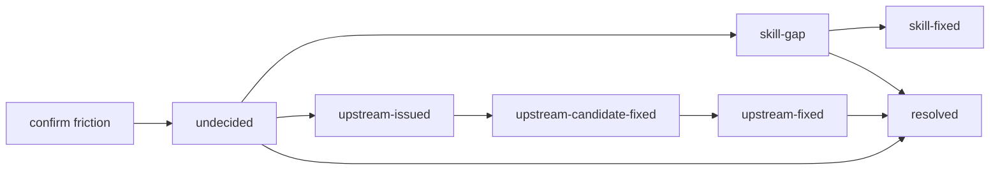

# VISION — friction-skills

English | [中文](VISION.zh.md)

This document explains what the friction skills do. For installation and usage, see [`README.md`](README.md). This repo also ships [`drafts.md`](skills/friction-lifecycle/drafts.md), which records the full design reasoning process.

"Agent = Model + Harness". The model is responsible for reasoning; the Harness is what actually gets the job done — file system, code execution, planning.

The purpose of these skills is to make the Harness iterate on itself.

## Definition

Friction is a systematic blocker encountered in the task loop.

A limit formula describes the iteration of the Harness:

$$\text{Agent} = \lim_{\Delta(\text{Harness}) \to 0} \left( \text{Model} + \text{Harness} - \Delta(\text{Harness}) \right)$$

It describes how an Agent behaves in a specific domain: an ideal Harness can support the complete task chain, but because the Harness falls short, a $\Delta$ appears.

**Definition (source of friction)**:

$$\text{Friction} \triangleq \Delta(\text{Harness})$$

At the macro level, we define Friction as follows: if an Agent is led to a wrong result by errors and ambiguities in the Harness, then Friction has occurred.

For a known goal + harness, the same blocker recurs until its root cause is handled. Therefore, Friction is a property of the system, a failure mode of the model with respect to the goal, and the attribution target for Harness improvement.

Usually, as task complexity grows, the Agent must handle more task generalization at once, and Friction becomes non-negligible.

**A corollary formula**: (Friction = the difference between the actual cumulative cost and the optimal cost)

$$\text{Friction} = \sum_{i} \left( c_{\text{actual}}(a_i) - c_{\text{optimal}}(a_i) \right)$$

This is quite similar to the regret concept in reinforcement learning (RL): the total loss accumulated over the learning process from suboptimal decisions made because the optimal policy is unknown.

Therefore, for a deterministic task, zero friction (regret = 0) — the Agent runs smoothly within an environment inside its capability range — implies the agent necessarily delivers in one shot.

Of course, at the micro level, Friction concretely includes:

- project dependency guarantees not matching the actual experience (DbC)
- toolchains lacking mechanisms that prevent errors or recover from them (Fault Tolerance)
- systematic gaps exposed by operational errors (Seam)

Friction makes the Agent waste too much context on attempts unrelated to its own task, so it fails to find the correct solution, hurting progress and outcomes; due to attention-mechanism issues, it can also cause Lost in the middle.

## What do these skills do?

Use the RLM (Recursive Language Model) idea to heuristically analyze Friction and solidify it into concrete procedures.

### `friction-lifecycle`: the lifecycle

I ask the Agent to treat the Skills as a knowledge base and do Context RAG management. Since the Harness includes Context Engineering and Tool Contracts, two tags describe these two aspects, marked as `skill-gap` and `upstream-issue`.

Every friction follows a stateful investigation path, and the state is recorded by tags:

- **skill-gap**: the visible Skill information has a gap — create a gap file in the separate `skills/.skill-gaps` repo and commit it immediately
- **upstream-issued**: the friction has an upstream owner — dispatch an agent to investigate, register an issue, and push a candidate fix
- **resolved**: no unfinished path remains

### `friction-problem-solver`: RLM recursion

The agent calls a subagent and briefs it on the situation. This naturally separates Friction from its own context.

The subagent helps the agent characterize the Friction; if an issue needs to be filed, it attempts the fix in a sandbox for the identified issue. Those procedures are likewise solidified into skills.

See `issue-lifecycle` (issue lifecycle) and `issue-worktree-sandbox` (using a worktree to attempt friction fixes).

In the design, seven skill-design principles are summarized as follows (I have organized the mathematical formalization; I have not yet added mathematical derivations):

1. low mental burden → state space · information entropy · cognitive complexity
2. incremental progress → finite state search · state gates · heuristic expansion · pruning
3. execution stability → finite state machine · checkpoints · recoverable transitions
4. sandboxing → set isolation · disjoint writable sets · boundary invariants
5. not over-constrained → feasible solution space · constraint minimization · satisfiability
6. no overreach → permission lattice · access control · authority-state invariants
7. credibility → evidence-chain graph · source hierarchy · Bayesian updates

## Self-convergence of the Harness framework design

Thoughts on DbC and Seam (no skill procedures yet):

DbC: Design by Contract
Seam: capability seam

### seam is the attribution point of friction

A seam is composed of: Definition, Provider, Consumer.

Friction exists before the seam does.

The capability model of a seam can guide the agent to understand friction. Every Tool should provide a model-facing schema as the seam interface, so the agent can analyze friction.

A subagent can be defined inside a Tool schema, existing as `rlm.query(ctx)`. One way of multi-agent collaboration.

## References

- [Effective Harnesses for Long Running Agents](https://www.anthropic.com/engineering/effective-harnesses-for-long-running-agents) Anthropic
- Recursive Language Model ([arxiv 2512.24601](https://arxiv.org/abs/2512.24601))
- [Design by Contract](https://en.wikipedia.org/wiki/Design_by_contract) — Bertrand Meyer (*Object-Oriented Software Construction*, 1997)
- Language model harnesses are compositional generalizers [blog](https://alexzhang13.github.io/blog/2026/harness/)
- DeepSeek Harness official tutorial [Three-role capability design](https://deepseek-harness.github.io/deepseek-harness/develop/practice/) 
