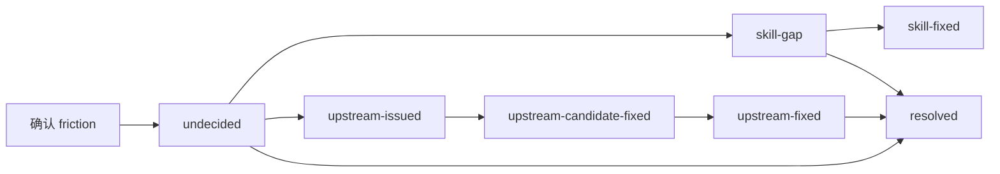

# VISION — friction-skills

本文档说明 friction skills 做什么。安装与使用见 [`README.md`](README.md)。 本仓库附带 [`drafts.md`](skills/friction-lifecycle/drafts.md) 包含了设计推演全过程。 

"Agent = Model + Harness"。模型负责推理，Harness 负责让它真正完成任务——文件系统、代码执行、规划。

这套 skills 的目的就是让 Harness 自动迭代。 

## 定义

Friction 是任务循环中遇到的系统性卡点。

用一个极限公式来描述 Harness 的迭代：

$$\text{Agent} = \lim_{\Delta(\text{Harness}) \to 0} \left( \text{Model} + \text{Harness} - \Delta(\text{Harness}) \right)$$

描述 Agent 在特殊领域的表现，理想的 Harness 是可以支撑完整任务链条的，不过因为 Harness 的不足，会产生 $\Delta$。

**定义（摩擦来源）**：

$$\text{Friction} \triangleq \Delta(\text{Harness})$$

宏观上，我们定义 Friction，如果 Agent 在任务中因为 Harness 的错误和模糊性，导向了错误的结果，说明发生了 Friction。

对于一个已知的 goal + harness，同一个卡点会反复出现，直到它的根因被处理。因此，Friction 是系统的属性，是模型对于 goal 的失效模式，也是 Harness 改进的归因。

通常当任务复杂性增大时，Agent 需要同时处理更多的任务泛化，Friction 会变得不可忽视。

**一个推论公式**：（Friction = 实际累积成本与最优成本之差）

$$\text{Friction} = \sum_{i} \left( c_{\text{actual}}(a_i) - c_{\text{optimal}}(a_i) \right)$$

这和强化学习（RL）的 regret 概念比较类似。（在整个学习过程中，因为“不知道最优策略”而做出的次优决策，所累积的总损失）

因此对于一个确定性任务来说，零 friction（regret = 0），即 Agent 平滑运行在能力范围内的环境中，则 agent 必然 one-shot 完成交付。

当然，回到微观层面，Friction 具体可以包括：

- 项目依赖保证与实际体验不符（DbC）
- 工具链缺少阻止错误或恢复的机制（Fault Tolerance）
- 操作错误所暴露的系统性缺口（Seam）

Friction 会导致 Agent 浪费太多上下文在和自身任务不相关的尝试上，找不到正确解法，影响问题的进度和解决结果，由于注意力机制的问题，还会导致 Lost in the middle。

## 这些 Skills 做了什么？

使用 RLM (Recursive Language Model) 的思路对 Friction 进行启发式分析，固化成具体流程。

### `friction-lifecycle`: 生命周期

我会要求 Agent 将 Skills 当做知识库，做 Context RAG 管理。由于 Harness 包括 Context Engineering 和 Tool Contracts，可以用 tag 来说明这两项，标记为 `skill-gap` 和 `upstream-issue`。

每个 friction 都走一条有状态的调查路径，状态由 tag 记录：

- **skill-gap**：可见 Skill 信息有缺口——在 `skills/.skill-gaps` 独立仓库创建 gap 文件并立即提交
- **upstream-issued**：friction 有上游归属——派 agent 调查、登记 issue、推进候选修复
- **resolved**：不存在未完成路径

### `friction-problem-solver`: RLM 递归

让 agent 调用 subagent，并告知他相关情况。天然分离了 Friction 和自身的上下文。

subagent 会协助 agent 对 Friction 定性，如果需要落 issue，则会对明确的 issue 进行 sandbox 尝试。相关的流程也一样固化为 skills。

见 `issue-lifecycle`（issue 生命周期） 和 `issue-worktree-sandbox`（用 worktree 进行 friction 解决尝试）。

在设计中，归纳了7个 skills 设计原则如下：（我整理了数学形式化抽象，暂时没有补充数学推导）

1. 心智负担小 → 状态空间 · 信息熵 · 认知复杂度
2. 渐进推进 → 有限状态搜索 · 状态门 · 启发式展开 · 剪枝
3. 执行稳定性 → 有限状态机 · 检查点 · 可恢复转换
4. 沙盒性 → 集合隔离 · 可写集不相交 · 边界不变量
5. 不过度约束 → 可行解空间 · 约束最小化 · 可满足性
6. 不越权 → 权限格 · 访问控制 · 权威状态不变量
7. 可信度 → 证据链图 · 来源层级 · 贝叶斯更新

## 设计 Harness 框架的自我收敛

关于 DbC 和 Seam 的思考（暂时没有 skill 流程）：

DbC：Design by Contract（契约式设计）
Seam：capability seam

### seam 是 friction 的归因点

seam 的组成是：Definition，Provider，Consumer。

friction 先于 seam 存在。

通过 seam 的能力模型可以引导 agent 理解 friction。每个 Tool 应该提供一个 model-facing schema，作为 seam 接口方便 agent 分析 friction。

subagent 可以定义在 Tool schema 中，作为 rlm.query(ctx) 而存在。一种多 agent 协作的方法。

## 参考

- [Effective Harnesses for Long Running Agents](https://www.anthropic.com/engineering/effective-harnesses-for-long-running-agents) Anthropic
- Recursive Language Model（[arxiv 2512.24601](https://arxiv.org/abs/2512.24601)）
- [Design by Contract](https://en.wikipedia.org/wiki/Design_by_contract) — Bertrand Meyer（《Object-Oriented Software Construction》，1997）
- Language model harnesses are compositional generalizers [blog](https://alexzhang13.github.io/blog/2026/harness/)
- DeepSeek Harness 官方教程 [Three-role capability design](https://deepseek-harness.github.io/deepseek-harness/develop/practice/) 

